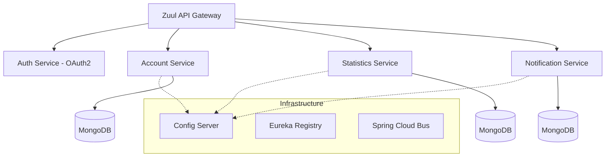
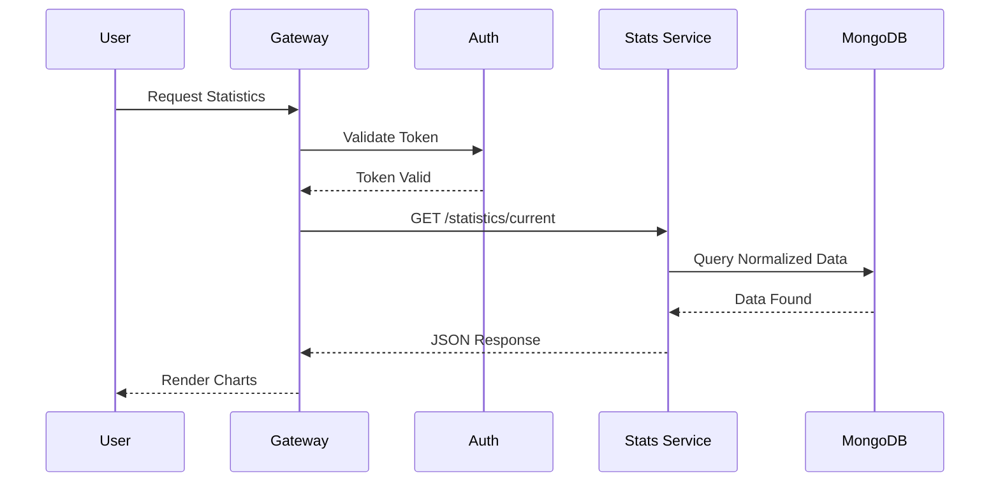

# 💰 FinTrack: Advanced Distributed Financial Microservices


FinTrack is a comprehensive financial advisory platform built using a **Microservice Architecture Pattern**. It leverages the full **Spring Cloud** stack to demonstrate distributed configuration, service discovery, and fault tolerance in a high-stakes fintech environment.

## 🏗️ Service Mesh Architecture

FinTrack is composed of multiple functional and infrastructure services working in concert:



## ⚡ Core Features & Microservices

- **Account Service**: Manages user profiles, income/expense tracking, and savings goals.
- **Statistics Service**: Real-time cash flow analytics and time-series data normalization.
- **Notification Service**: Automated reminders and backup alerts via scheduled workers.
- **Auth Service**: Secure machine-to-machine and user-to-service communication via OAuth2.

## 🔄 Distributed Data Flow



## 🛠️ Infrastructure Stack

- **Service Discovery**: Netflix Eureka
- **Load Balancing**: Netflix Ribbon
- **Fault Tolerance**: Netflix Hystrix (Circuit Breaker)
- **Declarative HTTP**: Feign Clients
- **Config Management**: Spring Cloud Config
- **Tracing**: Spring Cloud Sleuth + Zipkin

## 🚀 Deployment

### Prerequisites
- Docker & Docker Compose
- Maven 3.6+
- 4GB+ RAM

### Quick Start (Production Mode)
```bash
docker-compose up -d
```

### Development Mode (Build from Source)
```bash
mvn package -DskipTests
docker-compose -f docker-compose.yml -f docker-compose.dev.yml up
```

---
*Engineered and Maintained by Saanvi Rajput. A showcase of modern distributed systems.*
